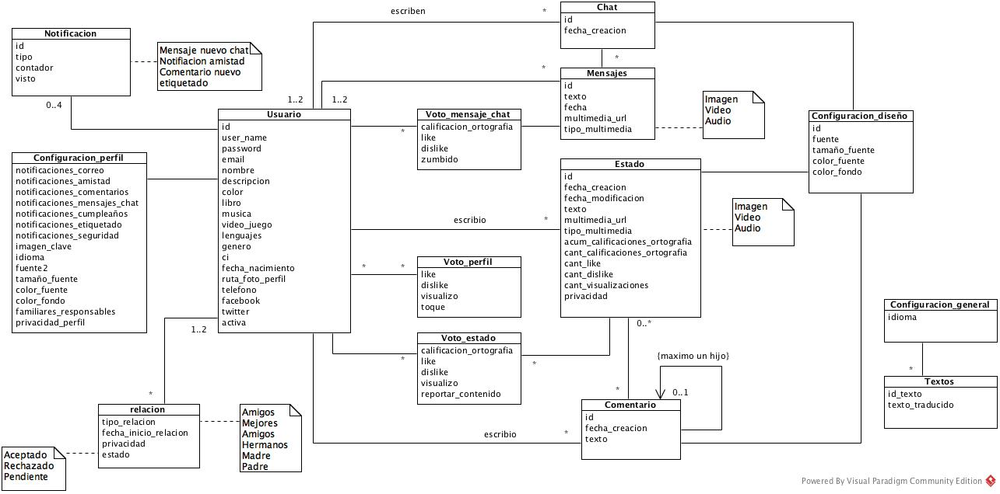
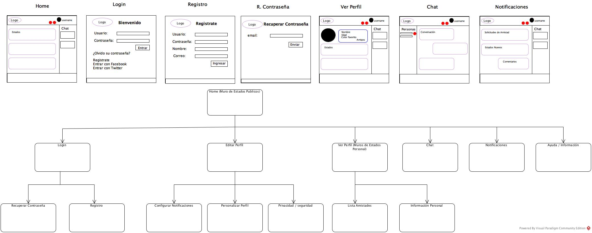

# PROYECTO_ATI_01_2017
	Proyecto Red Social de Aplicaciones con la Tecnología Internet 01-2017 UCV

	Platillas para trabajar con el proyecto de ati RedParAti, en plantilla0 esta el diseño básico css, y en la plantilla 2 un ejemplo de como trabajar el ajax. Todo basado en lo que he aprendido en los laboratorios de Ati xd.

## Para ver la pagina con Github Pages
	Bueno estoy probando esto, pero debería ser aqui 
	* https://musthagon.github.io/PROYECTO_ATI_01_2017/Plantilla0_Dise%C3%B1o/

## Cosas que hay que hacer:
	- [x] Link Trello https://trello.com/b/ABPfB7iL/backlog-m%C3%B3dulo-estado :smile:
	- [ ] Comprobar que podamos trabajar todos por github :sweat:
	- [ ] Hacer plantilla de html del estado con navegación :smile:
	- [ ] Y pensando las otras cosas... :stuck_out_tongue:

## Modelo de Datos
	
	
## Modelo de Navegación
	

## :warning: Pendiente:
	* Activar Javascript
	* Estoy probando las cosas con Xampp - Apache
	* Estoy usando Google Chrome